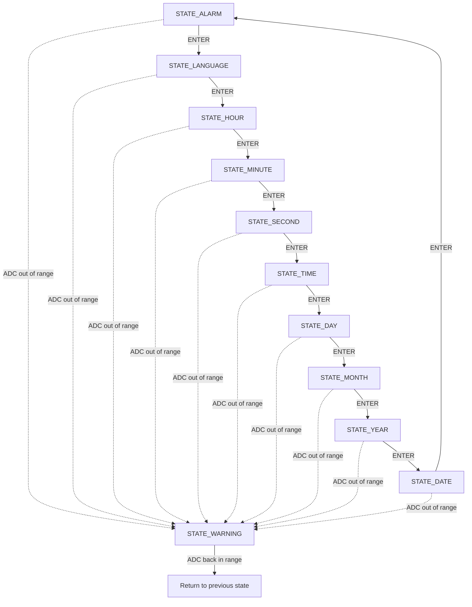
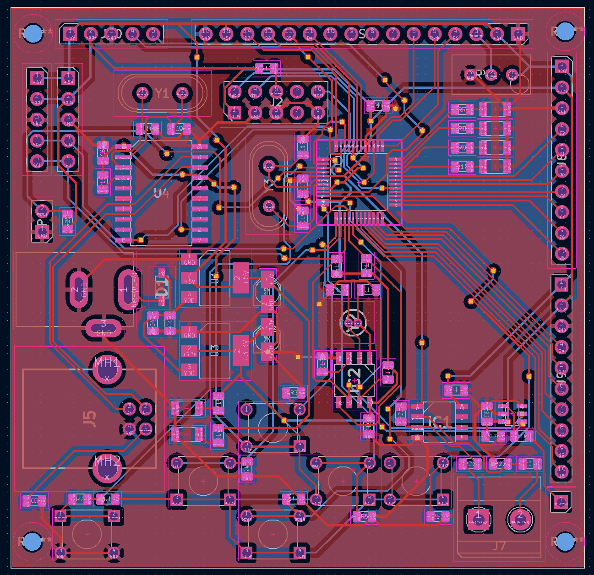

# ALARM BOARD LPC1114/302


This repository contains the firmware and validation artefacts for **ALARM_BOARD_LPC1114_302**, developed within the course **PBLE02 – Board Bring-Up and Validation of Electronic Prototypes**, offered by **IESTI – Institute of Systems Engineering and Information Technology** at **UNIFEI – Federal University of Itajubá**, taught by **Prof. Dr. Rodrigo Maximiano Antunes de Almeida**.

The main goal of this work is the bring-up and functional validation of a **printed circuit board (PCB)** designed by students in **PBLE01 (2022)**. In practical terms, the project verifies that the board’s key hardware blocks are operational (clocks, GPIO, UART, I²C, ADC, RTC, LCD and LEDs) and that they can be integrated into a coherent application built around a clear and testable architecture.

The firmware was developed using **MCUXpresso IDE**, with CMSIS headers and direct register-level access for the LPC11xx family, supported by the official microcontroller documentation (e.g., **UM10398**).

<div align="center">

    


</div>

---

## System overview

The application is organised into small modules to keep the code readable during validation and to allow isolated testing. The board behaves as an interactive LCD-driven system, controlled by push buttons and also by UART commands, continuously sampling an ADC channel and enforcing a simple alarm-by-range mechanism. When the ADC value exits the configured range, the firmware temporarily enters a warning mode and provides a clear visual indication.

Hardware and firmware blocks exercised by this project include:

- GPIO and push buttons for user interaction, including a debouncing strategy.
- LCD 16x2 in 4-bit mode as the user interface for menus and values.
- UART for event injection and parameter configuration through a lightweight protocol.
- I²C and an external RTC for reading/writing time and date.
- ADC for analogue acquisition (a potentiometer is used as a sensor surrogate in the demo).
- LEDs for visual feedback during normal operation and warning signalling.

---

## Firmware features

### LCD menu interface
The LCD acts as the main interface. Each state maps to a screen with a fixed title (top row) and a data/values area (bottom row). The system keeps state-specific behaviour inside dedicated handler functions so changes remain local and the overall flow remains predictable.

### Buttons and event layer
The push buttons (UP, DOWN, LEFT, RIGHT and ENTER/SELECT) generate events for navigation and parameter adjustment. In addition to GPIO, the project accepts UART inputs so you can drive the interface and configure values without relying only on local hardware actions.

A key design point is that the state machine consumes a single event stream: the state logic does not need to know whether an event came from a button or from serial; it only reacts to the event code.

### UART protocol support
Besides single-character navigation commands, the firmware supports a simple delimited message mode to push values (for example, to set thresholds or inject time/date data). This is particularly useful during board validation because you can repeat tests quickly, automate input sequences, and verify that the parsing and application logic are stable.

### ADC monitoring and alarm range checking
The ADC is read continuously in the main loop. The user configures two thresholds:

- Alarm Low (lower bound)
- Alarm High (upper bound)

If the ADC value goes outside the configured range, the system switches to a warning state and enables a clear LED/LCD indication. Once the ADC value returns within the valid range, the firmware automatically returns to the previous state.

### RTC over I²C
Time and date are stored in an external RTC accessed via I²C. The firmware supports reading time/date for display and writing updated values when the user confirms configuration. BCD formatting is used where appropriate, matching the RTC register format.

---

## Finite State Machine (FSM)

The firmware is controlled by a finite state machine where each state corresponds to a specific screen and responsibility. The goal is to keep behaviour isolated: instead of a large loop with many branches, each mode is handled by its own routine, interpreting only the events that make sense for that state.

The main navigation occurs through ENTER, which advances to the next screen. LEFT/RIGHT/UP/DOWN adjust parameters depending on the active state. Independently, the ADC warning condition is evaluated continuously; if an alarm condition is detected, the system enters WARNING and later returns automatically when the ADC value is back within range.

Important note about STATE_TIME_VAR: the symbol exists in the state definitions (legacy/experimental), but it is not used in the final project flow and is intentionally omitted from the menu navigation and from the FSM diagram below.

### States used in this project

- STATE_ALARM: configuration of alarm thresholds (low/high).
- STATE_LANGUAGE: language selection.
- STATE_HOUR / STATE_MINUTE / STATE_SECOND: time configuration steps.
- STATE_TIME: current time display (RTC).
- STATE_DAY / STATE_MONTH / STATE_YEAR: date configuration steps.
- STATE_DATE: current date display (RTC).
- STATE_WARNING: alarm indication when ADC value is out of range.

### High-level state flowchart

The diagram below shows the intended menu flow and the global warning preemption logic.



---

## Demonstration


<!--

-->

In the demonstration setup, a potentiometer is connected to the ADC input to simulate the behaviour of a sensor. Rotating the potentiometer changes the sampled analogue value and the firmware reacts in real time, allowing you to observe the complete chain: ADC sampling, range comparison, warning signalling and the automatic transition to the WARNING state when the value leaves the configured range.


The demonstration also highlights menu navigation and state transitions, making it easy to see how the FSM coordinates the user interface and how inputs (buttons or UART) trigger state-dependent behaviour.

---

## Build and run (MCUXpresso)

This project was developed and tested with **MCUXpresso IDE**, and that is the recommended workflow to reproduce the same environment used during PBLE02.

Typical steps:

- Import the project into MCUXpresso.
- Ensure CMSIS headers in `required/` are included in the include paths.
- Build in Debug/Release as needed.
- Flash using the available SWD interface and run the firmware on the board.

---

## Kicad Project 

The hardware design for this board is fully documented in KiCad and is stored under docs/kicad/.
This directory contains everything needed to open, inspect, and reproduce the PCB design: the project file, the schematic, and the PCB layout. The intention here is to keep the electrical design and the manufacturing-ready layout versioned together with the firmware, so the validation work can always be traced back to a specific hardware revision.

In practical terms, you will find at `docs/kicad/`:

- The KiCad project file (.kicad_pro), which centralises project settings and links the design files;

- The schematic (.kicad_sch), where the complete circuit is defined and organised by functional blocks;

  

- The PCB layout (.kicad_pcb), which contains component placement, routing, copper zones, and mechanical constraints used for fabrication.

  


---

## Repository structure

```text
ALARM_BOARD_LPC1114_302/
├─ docs/
│  ├─ kicad/
│  │  ├─ alarm_project.kicad_pcb
│  │  ├─ alarm_project.kicad_pro
│  │  └─ alarm_project.kicad_sch
│  ├─ Guide_LPC111x.pdf
│  ├─ Project Documentation.pdf
│  └─ UM10398.pdf
├─ required/
│  ├─ cmsis_compiler.h
│  ├─ cmsis_gcc.h
│  ├─ cmsis_version.h
│  ├─ core_cm0.h
│  ├─ LPC11xx.h
│  ├─ power_profiles.h
│  └─ system_LPC11xx.h
├─ src/
│  ├─ test/
│  │  ├─ adcMain.c
│  │  ├─ i2cRtcMain.c
│  │  ├─ lcdMain.c
│  │  └─ testLed.c
│  ├─ adc.c
│  ├─ adc.h
│  ├─ clocks.h
│  ├─ event.c
│  ├─ event.h
│  ├─ i2cRtc.c
│  ├─ i2cRtc.h
│  ├─ LCD.c
│  ├─ LCD.h
│  ├─ LED.c
│  ├─ LED.h
│  ├─ main.c
│  ├─ output.c
│  ├─ output.h
│  ├─ peripherics.c
│  ├─ peripherics.h
│  ├─ serial.c
│  ├─ serial.h
│  ├─ stateMachine.c
│  ├─ stateMachine.h
│  ├─ var.c
│  └─ var.h
├─ .gitignore
├─ LICENSE
└─ README.md
```

---

## References


- Almeida, R. M. A. ESM_IHM — Interface Homem-Máquina (IHM) Repository. GitHub repository. Available at: https://github.com/rmaalmeida/ESM_IHM.git

- NXP Semiconductors. UM10398: LPC111x/LPC11Cxx User Manual. (User Manual, LPC11xx family).

- Fernandes, G.; Francisco, A. H. P.; Castro, F. S. Documentação_PBLE01. Project documentation (PBLE01, 2022).

- Rodrigues, R. P. Guide_LPC111x.pdf. Reference material used as baseline for the project. Available in this repository at: `docs/Guide_LPC111x.pdf`

---

## Credits

Authors:

- Eduardo Lenhatti
- Eduardo Castro
- Glauber Moura

**Federal University of Itajubá (UNIFEI) - 2025/2026**